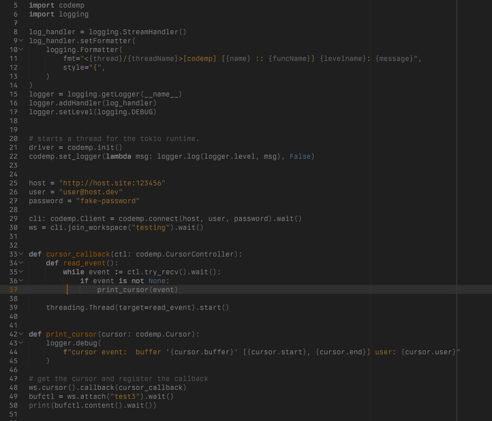
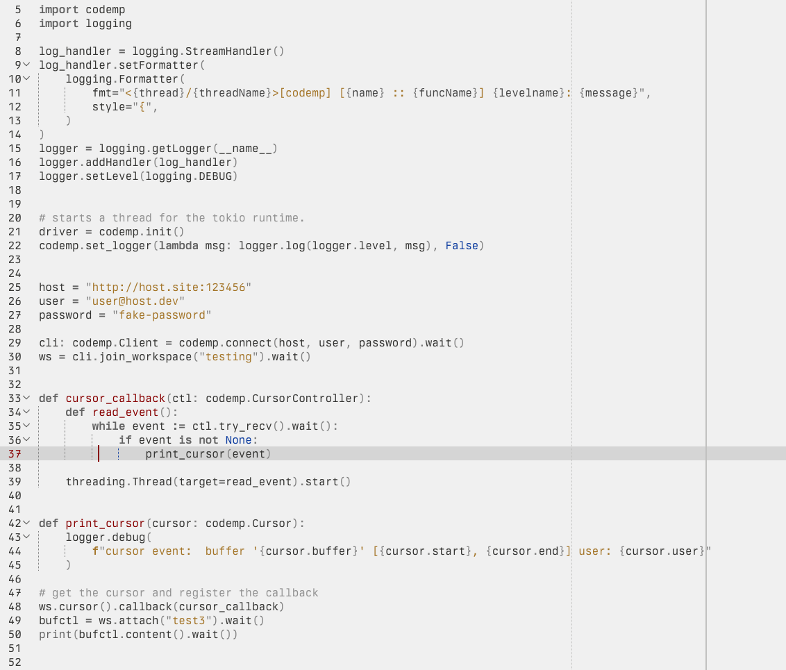
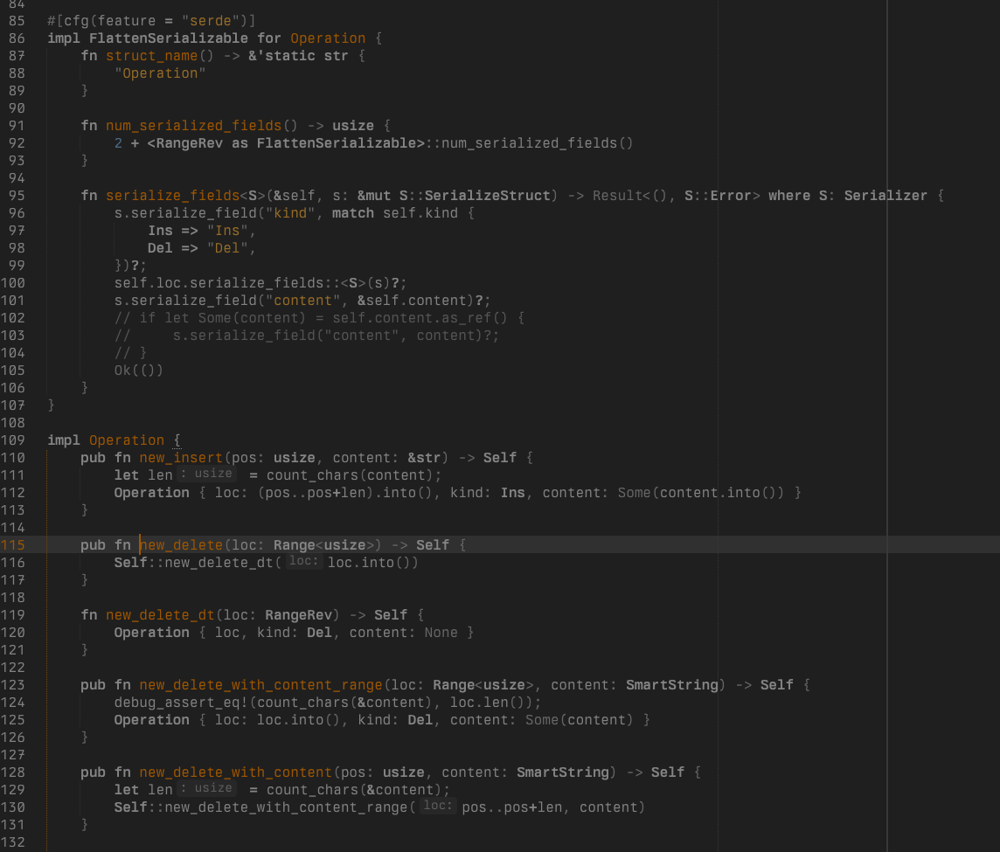
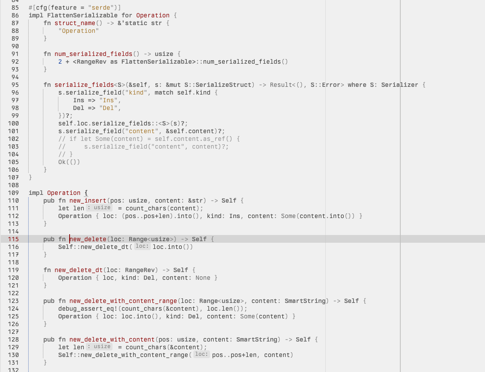

# Fight Sublime Color Scheme
A sublime text color scheme both in the light and dark variants.

These color schemes tend to be minimalistic so that you can concentrate on reading the code
without too much confusion about different syntax peculiarities, often uselessly expressed in color.
The goal was to make it easier to just read the code and let the word themselves tell you what it is doing and not the colours.

These color schemes prefer to separate code areas more than code syntax.

## Fight in the dark
The dark variant of the color scheme I started from a hyperminimal color scheme and slowly added small
refinement when I felt I needed them.

## Fight in the light
The light variant of the color scheme, this takes a bit inspiration from the github light color scheme,
as well as the luma color scheme. It strives to give maximum clarity and readability.

## Screenshots 
Python `fight-in-the-dark`:

Python `fight-in-the-light`:

Rust `fight-in-the-dark`:

Rust `fight-in-the-light`:

